# Ride Sharing System Design Diagrams

## 1. High Level Architecture Diagram

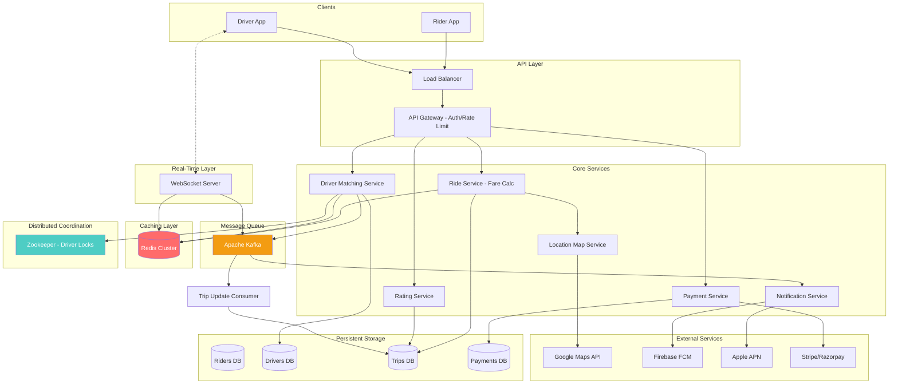

## 2. Ride Request Flow Sequence Diagram

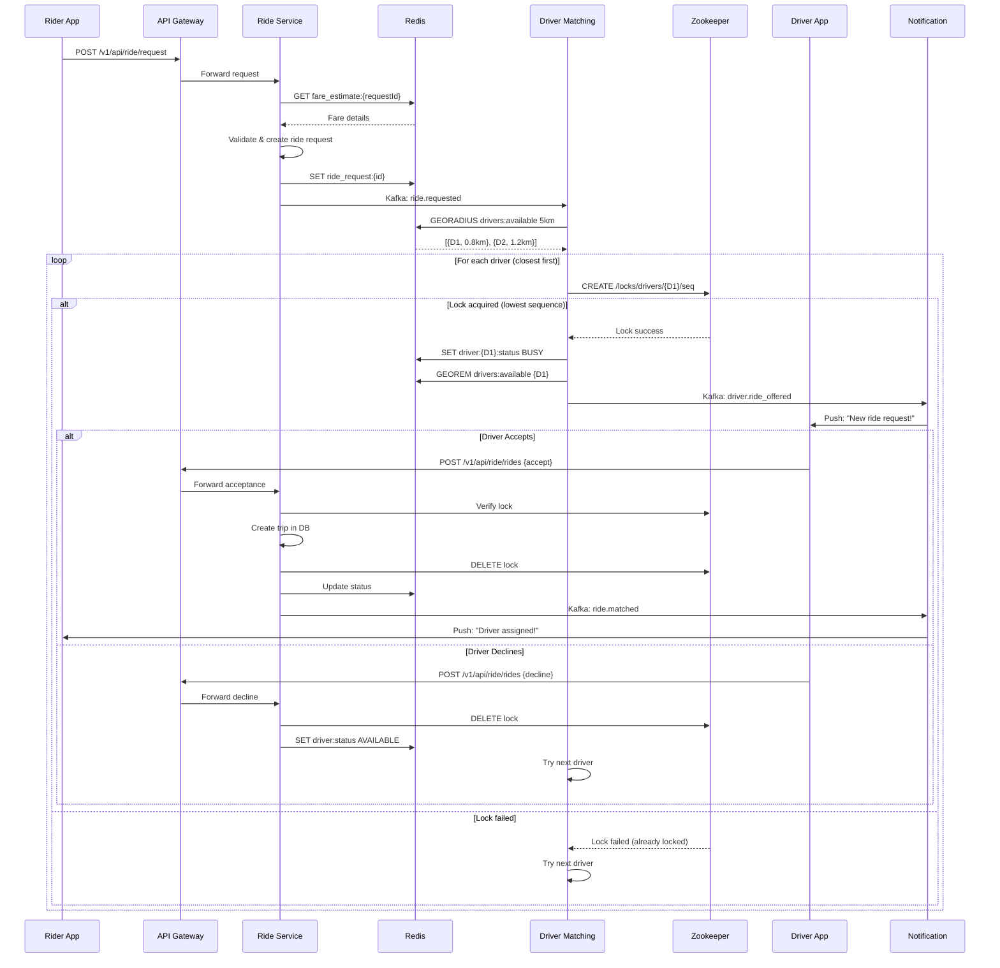

## 3. Real-Time Location Tracking Flow

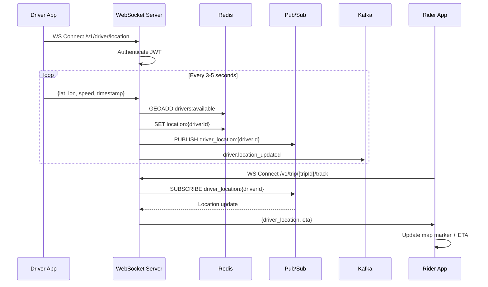

## 4. Surge Pricing Algorithm Flow

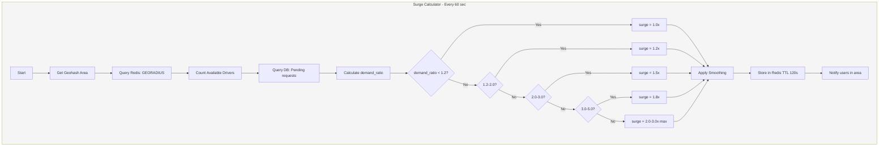

## 5. Database Entity Relationship Diagram

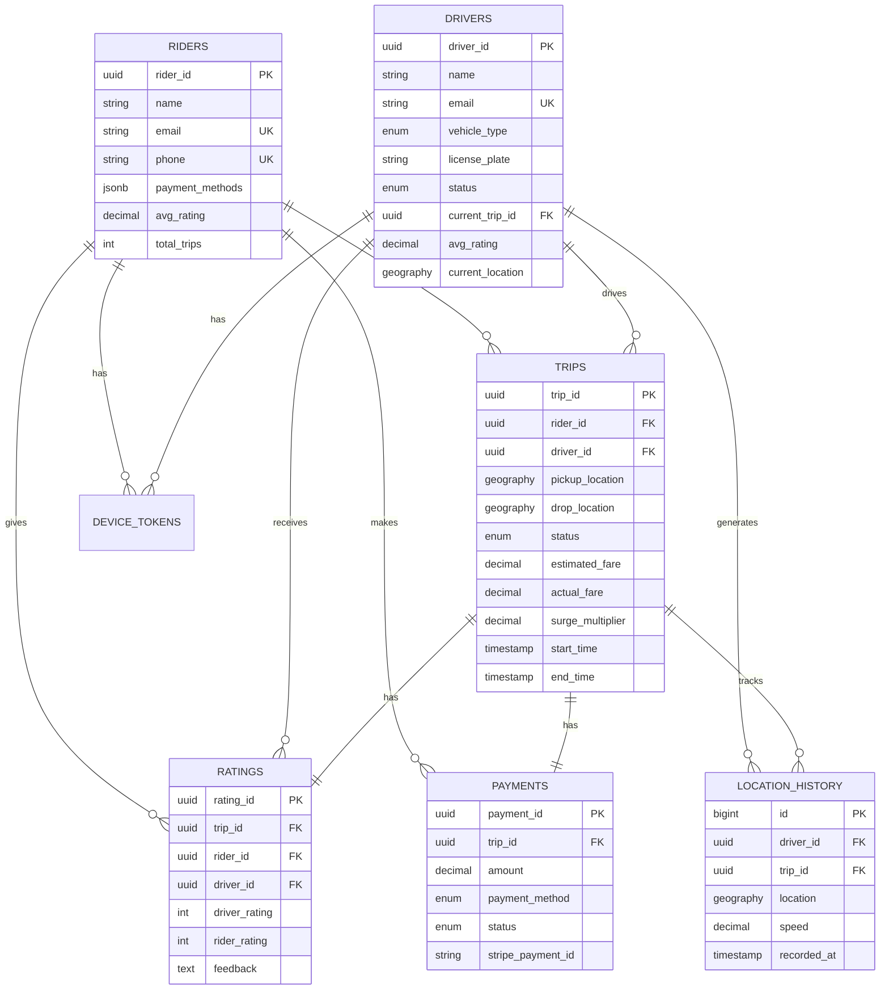

## 6. Zookeeper Driver Locking Mechanism

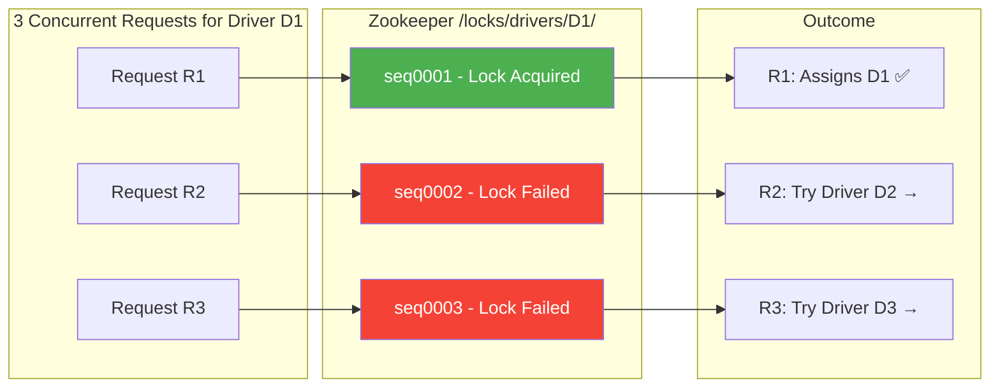

## 7. Trip State Machine

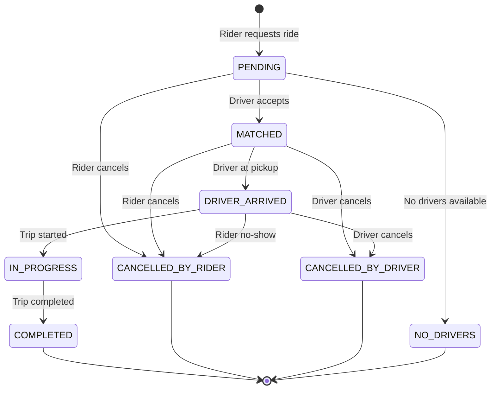

## 8. Notification Flow

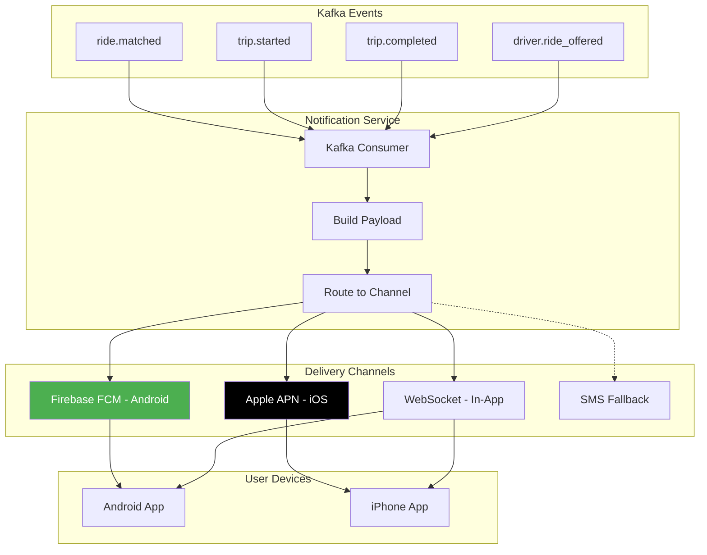

## 9. Redis Data Structure Overview

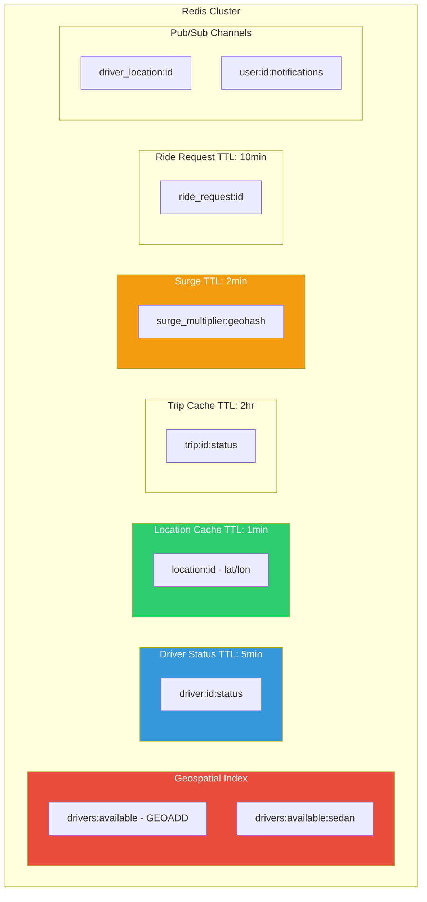

## 10. Scaling Architecture

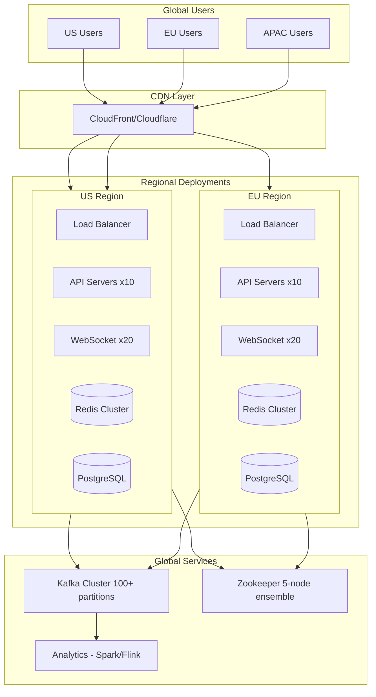

---

## Key Metrics Summary

| Component | Metric | Value |
|-----------|--------|-------|
| Redis GEORADIUS | 1M drivers search | ~10ms |
| Zookeeper Lock | Acquisition time | <10ms |
| WebSocket | Concurrent connections/instance | 10K |
| Kafka | Events/second | 100K+ |
| Driver Assignment | End-to-end latency | <1 sec |
| Push Notification | Delivery latency | 1-3 sec |
| WebSocket Update | In-app latency | <100ms |

---

## 11. Database Schema (PostgreSQL + PostGIS)

### Complete Entity Relationship Diagram

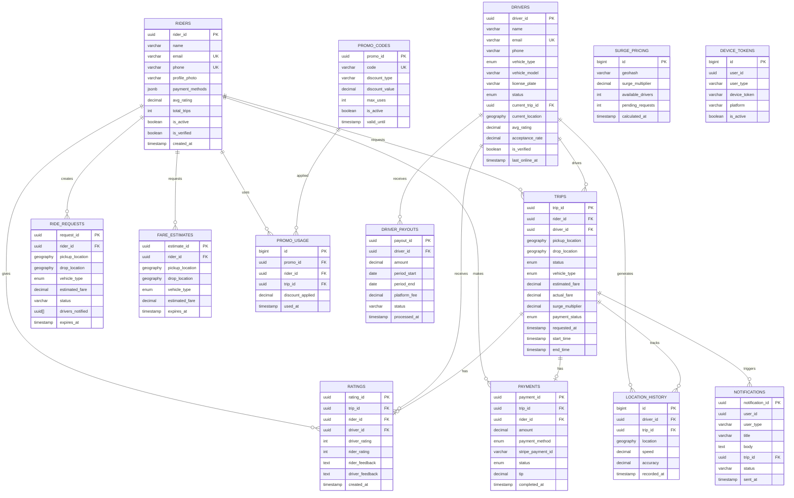

### Table Summary

| Table | Description | Key Columns |
|-------|-------------|-------------|
| **riders** | User accounts | rider_id, email, phone, payment_methods, avg_rating |
| **drivers** | Driver profiles | driver_id, vehicle_type, status, current_location, avg_rating |
| **trips** | All ride records | trip_id, rider_id, driver_id, status, fare, timestamps |
| **ride_requests** | Pending requests before matching | request_id, expires_at, drivers_notified |
| **ratings** | Trip ratings (anonymous) | rating_id, driver_rating, rider_rating |
| **payments** | Payment records | payment_id, amount, stripe_payment_id, status |
| **location_history** | Driver GPS tracking | driver_id, trip_id, location, speed |
| **driver_payouts** | Driver earnings | payout_id, amount, period_start/end |
| **surge_pricing** | Historical surge data | geohash, surge_multiplier, demand_ratio |
| **fare_estimates** | Cached fare estimates | estimate_id, estimated_fare, expires_at (5 min) |
| **device_tokens** | Push notification tokens | user_id, device_token, platform |
| **notifications** | Notification history | notification_id, type, status, sent_at |
| **promo_codes** | Discount codes | code, discount_type, max_uses |

### Key Indexes

```sql
-- Geospatial Indexes (GIST)
CREATE INDEX idx_drivers_location ON drivers USING GIST (current_location);
CREATE INDEX idx_trips_pending_location ON trips USING GIST (pickup_location) WHERE status = 'PENDING';

-- Status & Lookup Indexes
CREATE INDEX idx_drivers_active_available ON drivers(status) WHERE is_active = TRUE AND status = 'AVAILABLE';
CREATE INDEX idx_trips_rider ON trips(rider_id, created_at DESC);
CREATE INDEX idx_trips_driver ON trips(driver_id, created_at DESC);

-- Time-based Indexes
CREATE INDEX idx_location_history_recorded ON location_history(recorded_at DESC);
CREATE INDEX idx_surge_pricing_geohash ON surge_pricing(geohash, calculated_at DESC);
```

### Enums

```sql
-- Driver Status
CREATE TYPE driver_status AS ENUM ('AVAILABLE', 'BUSY', 'OFFLINE', 'IN_TRIP');

-- Vehicle Types
CREATE TYPE vehicle_type AS ENUM ('sedan', 'suv', 'bike', 'auto', 'pool');

-- Trip Status
CREATE TYPE trip_status AS ENUM (
    'PENDING', 'MATCHED', 'DRIVER_ARRIVED', 
    'IN_PROGRESS', 'COMPLETED', 
    'CANCELLED_BY_RIDER', 'CANCELLED_BY_DRIVER'
);

-- Payment Status
CREATE TYPE payment_status AS ENUM ('PENDING', 'COMPLETED', 'FAILED', 'REFUNDED');

-- Payment Method
CREATE TYPE payment_method_type AS ENUM ('card', 'wallet', 'cash', 'upi', 'net_banking');
```

### Key Relationships

```
┌─────────────────────────────────────────────────────────────────────────────┐
│                        DATABASE RELATIONSHIPS                                │
├─────────────────────────────────────────────────────────────────────────────┤
│                                                                              │
│  RIDERS ──────┬──────────────────────────────────────┐                      │
│       │       │                                       │                      │
│       │       ▼                                       ▼                      │
│       │   TRIPS ◄───────────────────────────── DRIVERS                      │
│       │       │                                       │                      │
│       │       ├──────────┬──────────┬────────────────┤                      │
│       │       │          │          │                │                      │
│       │       ▼          ▼          ▼                ▼                      │
│       │   RATINGS    PAYMENTS   NOTIFICATIONS   LOCATION_HISTORY            │
│       │                                                                      │
│       └──► RIDE_REQUESTS ──► (becomes) ──► TRIPS                            │
│       │                                                                      │
│       └──► FARE_ESTIMATES (TTL: 5 min)                                      │
│       │                                                                      │
│       └──► PROMO_USAGE ◄──── PROMO_CODES                                    │
│                                                                              │
│  DRIVERS ──► DRIVER_PAYOUTS (weekly/bi-weekly settlements)                  │
│                                                                              │
│  (Analytics) SURGE_PRICING ──► Historical demand/supply tracking            │
│                                                                              │
└─────────────────────────────────────────────────────────────────────────────┘
```
